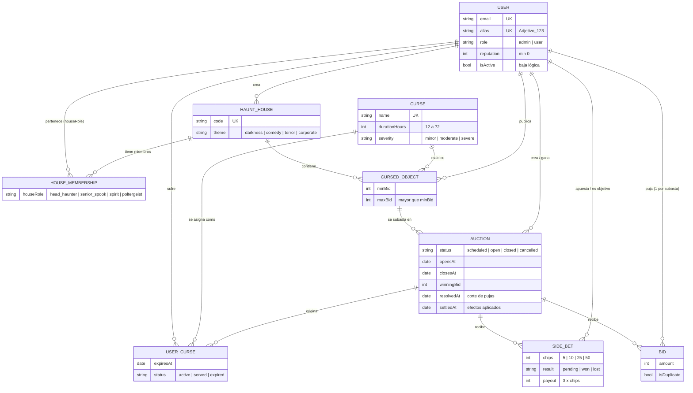

# PhantomBids API

## API en producción

<!-- URL_RENDER: reemplazar al desplegar (las 3 apariciones de URL_RENDER de esta sección) -->

|                  |                       |
| ---------------- | --------------------- |
| **URL base**     | `URL_RENDER`          |
| **Swagger UI**   | `URL_RENDER/api/docs` |
| **Health check** | `URL_RENDER/health`   |

Servicio gratuito de Render: si estuvo 15 minutos sin tráfico, la primera
petición tarda alrededor de un minuto en responder mientras se despierta.

**Para probarla:** abrir Swagger UI, ejecutar `POST /api/auth/login` con el
admin del seed (`admin@phantombids.dev` / `Admin123!`), copiar el `token`, tocar
**Authorize** y pegarlo. Una colección de Postman con el recorrido completo está
en [`docs/PhantomBids.postman_collection.json`](docs/PhantomBids.postman_collection.json).

---

## Qué es

PhantomBids es una plataforma de **subastas inversas secretas** con temática
fantasma. Cada usuario ofrece un monto en secreto y gana **la puja única más
baja**: el monto más bajo que nadie más repitió. Quien repite un monto queda
penalizado con una maldición y pierde reputación. Alrededor de las subastas hay
Haunt Houses (casas con miembros y roles), objetos malditos, apuestas paralelas
sobre quién gana y rankings. Esta API REST persiste todo eso en MongoDB y
reemplaza los datos mock del frontend (React + TypeScript).

## Stack

Impuesto por la rúbrica de la asignatura; no es una elección de diseño libre.

| Pieza                                              | Uso                                                     |
| -------------------------------------------------- | ------------------------------------------------------- |
| Node.js ≥ 20.19 + **Express 4** + TypeScript (ESM) | Servidor HTTP                                           |
| **MongoDB** (Atlas en producción) + **Mongoose 9** | Persistencia, schemas con validaciones                  |
| **JWT** (`jsonwebtoken`) + `bcryptjs`              | Autenticación                                           |
| **express-validator**                              | Validación de requests                                  |
| **swagger-ui-express** + `swagger-jsdoc`           | Documentación en `/api/docs`                            |
| helmet, cors, morgan, express-rate-limit, dotenv   | Seguridad, logs, configuración                          |
| Vitest, ESLint, Prettier                           | Tests y calidad                                         |
| **Render**                                         | Despliegue ([`docs/DESPLIEGUE.md`](docs/DESPLIEGUE.md)) |

---

## Arranque local

Requisitos: Node.js 20.19 o superior y npm, más una base MongoDB: un cluster
gratuito de **MongoDB Atlas** (el mismo que usa Render, con una base aparte
`phantombids_dev`) o **Docker**.

**¿Windows?** Seguí [`docs/ENTREGA.md`](docs/ENTREGA.md): tiene cada comando en
PowerShell, los dos caminos (Atlas recomendado, Docker Desktop como alternativa)
y la solución de problemas. El resumen de abajo es para bash con Docker.

```bash
git clone git@github.com:parra0727/phantombids_back.git
cd phantombids_back
npm install

# MongoDB local en Docker (8.2: mongo:8 / latest no arrancan en kernels Linux 6.19+)
docker run -d --name phantombids-mongo -p 27017:27017 mongo:8.2

# Variables de entorno
cp .env.example .env
# en .env: MONGODB_URI=mongodb://localhost:27017/phantombids
# y un JWT_SECRET propio (32+ caracteres), por ejemplo:
node -e "console.log(require('crypto').randomBytes(48).toString('hex'))"

npm run seed      # datos de prueba
npm run dev       # http://localhost:3000  ·  docs en http://localhost:3000/api/docs
```

| Script                            | Qué hace                                                                                      |
| --------------------------------- | --------------------------------------------------------------------------------------------- |
| `npm run dev`                     | Servidor con recarga (tsx watch)                                                              |
| `npm run build` / `npm start`     | Compila a `dist/` / corre lo compilado                                                        |
| `npm run seed`                    | Borra y repuebla la base de desarrollo. Se niega con `NODE_ENV=production` salvo `-- --force` |
| `npm test`                        | Tests del resolvedor de subastas (Vitest)                                                     |
| `npm run typecheck`               | Chequeo de tipos de `src` y `tests`                                                           |
| `npm run lint` / `npm run format` | ESLint / Prettier                                                                             |

### Credenciales del seed

| Rol       | Email                                                                                                                | Contraseña    |
| --------- | -------------------------------------------------------------------------------------------------------------------- | ------------- |
| **admin** | `admin@phantombids.dev`                                                                                              | `Admin123!`   |
| user (8)  | `sombrio@`, `errante@`, `nebuloso@`, `umbral@`, `gelido@`, `silente@`, `nocturno@`, `fantasmal@` + `phantombids.dev` | `Phantom123!` |

`sombrio@phantombids.dev` es head_haunter de Casa Oscuridad: sirve para probar
cierres de subasta y administración de casas sin ser admin.

## Variables de entorno

Todas validadas al arrancar (`src/config/env.ts`): si falta una obligatoria o
tiene formato inválido, el proceso termina diciendo cuál.

| Variable             | Descripción                                     | Ejemplo                                 | Obligatoria                  |
| -------------------- | ----------------------------------------------- | --------------------------------------- | ---------------------------- |
| `PORT`               | Puerto HTTP. En Render lo inyecta la plataforma | `3000`                                  | No (3000)                    |
| `NODE_ENV`           | `development`, `production` o `test`            | `development`                           | No (`development`)           |
| `MONGODB_URI`        | Cadena de conexión a MongoDB                    | `mongodb://localhost:27017/phantombids` | **Sí**                       |
| `JWT_SECRET`         | Secreto para firmar tokens, 32 caracteres o más | `b3f1…` (48 bytes hex)                  | **Sí**                       |
| `JWT_EXPIRES_IN`     | Vigencia del token                              | `1d`                                    | No (`1d`)                    |
| `BCRYPT_ROUNDS`      | Costo de bcrypt (4–15)                          | `10`                                    | No (10)                      |
| `CORS_ORIGIN`        | Orígenes permitidos, separados por coma         | `http://localhost:5173`                 | No (`http://localhost:5173`) |
| `AUTO_CLOSE_ENABLED` | Scheduler de apertura y cierre de subastas      | `true`                                  | No (`true`)                  |

---

## Endpoints

Todas las rutas cuelgan de `/api`. Respuestas: `{ success: true, data, meta? }`
o `{ success: false, error: { message, code, details } }`. Detalle de cada
endpoint (parámetros, cuerpos, códigos) en Swagger UI.

Protección: **pública**, **auth** (token JWT), **auth+admin**
(`autenticar` + `autorizar('admin')`). "Rol de casa" significa que el service
verifica el rol dentro de la Haunt House; `admin` siempre pasa.

### Auth

| Método | Ruta             | Protección          | Rol requerido                 |
| ------ | ---------------- | ------------------- | ----------------------------- |
| POST   | `/auth/register` | pública, rate limit | — (el rol se fuerza a `user`) |
| POST   | `/auth/login`    | pública, rate limit | —                             |
| GET    | `/auth/me`       | auth                | —                             |
| PUT    | `/auth/me`       | auth                | —                             |

### Users

| Método | Ruta                | Protección | Rol requerido                                |
| ------ | ------------------- | ---------- | -------------------------------------------- |
| GET    | `/users`            | auth+admin | admin                                        |
| GET    | `/users/:id`        | auth       | — (email solo para el dueño o admin)         |
| PUT    | `/users/:id`        | auth       | dueño o admin (`role`/`isActive` solo admin) |
| DELETE | `/users/:id`        | auth+admin | admin (baja lógica)                          |
| GET    | `/users/:id/curses` | auth       | dueño o admin                                |

### Curses (catálogo)

| Método | Ruta          | Protección | Rol requerido |
| ------ | ------------- | ---------- | ------------- |
| GET    | `/curses`     | pública    | —             |
| GET    | `/curses/:id` | pública    | —             |
| POST   | `/curses`     | auth+admin | admin         |
| PUT    | `/curses/:id` | auth+admin | admin         |
| DELETE | `/curses/:id` | auth+admin | admin         |

### Houses y miembros

| Método | Ruta                          | Protección | Rol requerido                            |
| ------ | ----------------------------- | ---------- | ---------------------------------------- |
| GET    | `/houses`                     | pública    | —                                        |
| GET    | `/houses/:id`                 | pública    | —                                        |
| POST   | `/houses`                     | auth       | — (queda como head_haunter)              |
| PUT    | `/houses/:id`                 | auth       | head_haunter de la casa o admin          |
| DELETE | `/houses/:id`                 | auth       | head_haunter de la casa o admin          |
| GET    | `/houses/:id/members`         | pública    | —                                        |
| POST   | `/houses/:id/members`         | auth       | head_haunter o admin                     |
| PUT    | `/houses/:id/members/:userId` | auth       | head_haunter o admin                     |
| DELETE | `/houses/:id/members/:userId` | auth       | head_haunter, admin, o el propio miembro |

### Objects

| Método | Ruta           | Protección | Rol requerido                 |
| ------ | -------------- | ---------- | ----------------------------- |
| GET    | `/objects`     | pública    | —                             |
| GET    | `/objects/:id` | pública    | —                             |
| POST   | `/objects`     | auth       | miembro de la casa o admin    |
| PUT    | `/objects/:id` | auth       | creador, head_haunter o admin |
| DELETE | `/objects/:id` | auth       | creador, head_haunter o admin |

### Auctions y bids

| Método | Ruta                         | Protección                              | Rol requerido                                    |
| ------ | ---------------------------- | --------------------------------------- | ------------------------------------------------ |
| GET    | `/auctions`                  | pública                                 | —                                                |
| GET    | `/auctions/:id`              | pública (con token suma la puja propia) | —                                                |
| POST   | `/auctions`                  | auth                                    | miembro de la casa del objeto o admin            |
| PUT    | `/auctions/:id`              | auth                                    | creador, head_haunter o admin (solo `scheduled`) |
| DELETE | `/auctions/:id`              | auth                                    | creador, head_haunter o admin (solo `scheduled`) |
| POST   | `/auctions/:id/close`        | auth                                    | head_haunter o admin                             |
| GET    | `/auctions/:id/result`       | pública                                 | — (409 si sigue abierta)                         |
| GET    | `/auctions/:id/participants` | pública                                 | — (alias, sin montos)                            |
| POST   | `/auctions/:id/bids`         | auth                                    | —                                                |
| GET    | `/auctions/:id/bids/mine`    | auth                                    | —                                                |
| GET    | `/auctions/:id/bids`         | pública                                 | — (403 mientras sea secreta)                     |

### Bets y rankings

| Método | Ruta              | Protección | Rol requerido |
| ------ | ----------------- | ---------- | ------------- |
| POST   | `/bets`           | auth       | —             |
| GET    | `/bets/mine`      | auth       | —             |
| GET    | `/bets/:id`       | auth       | dueño o admin |
| DELETE | `/bets/:id`       | auth       | dueño o admin |
| GET    | `/rankings?type=` | pública    | —             |

Además: `GET /` (información de la API), `GET /health` (200, o 503 si la base
está caída), `GET /api/docs` (Swagger UI) y `GET /api/docs.json`.

---

## Modelo de datos



Índices únicos que son reglas del producto: `(auction, user)` en Bid (una puja
por usuario y subasta), `(auction, bettor)` en SideBet, `(user, house)` en
HouseMembership y `(user, sourceAuction)` en UserCurse.

---

## Reglas de negocio asumidas

**El enunciado de la asignatura describe las pantallas del frontend, pero no
define las reglas de negocio.** No dice cómo se resuelve una subasta, cómo se
calcula la reputación, qué hace cada maldición ni qué mide cada ranking. Un
backend no puede dejar esas decisiones sin tomar, así que se adoptaron supuestos
mínimos y coherentes con lo que el enunciado sí describe. Están escritos en
[`docs/REGLAS.md`](docs/REGLAS.md), con un resumen de cada vacío y la decisión
provisional.

Resumen:

- **Subasta:** gana la puja única más baja. Sin montos únicos se cancela
  (`no_unique_bids`); sin pujas, también (`no_bids`). Una puja por usuario,
  entera, dentro de `[minBid, maxBid]`.
- **Secreto:** el monto es secreto hasta el cierre; la participación (quién
  pujó) es pública porque las apuestas la necesitan.
- **Penalización:** cada puja duplicada cuesta −10 de reputación y una maldición
  al azar del catálogo, con la duración de esa maldición.
- **Maldiciones:** se registran y se muestran, pero **no restringen acciones**:
  inventar efectos sería inventar producto.
- **Reputación:** arranca en 100 y nunca baja de 0. Es la moneda de las apuestas.
- **Apuestas:** fichas 5/10/25/50, descontadas al apostar; ganar paga 3×; una por
  subasta; cancelable mientras la subasta siga abierta.
- **Rankings:** Worst Bidder (pujas duplicadas), Total Cursed (maldiciones
  recibidas), Free Spirit (participaciones sin duplicar), Betting Prophet (tasa
  de acierto, mínimo 3 apuestas resueltas).
- **Roles:** `admin`/`user` globales (los que exige la rúbrica, middleware
  `autorizar`) y, por separado, roles por casa. Solo `head_haunter` administra
  una casa, y una casa nunca se queda sin head_haunter.

**Están aisladas y son reemplazables.** La resolución de la subasta es una
función pura (`src/services/auctionResolver.ts`) con sus tests; la reputación
vive en `reputation.service.ts` y los rankings en `ranking.service.ts`. Si la
docente entrega las reglas oficiales, se actualiza REGLAS.md, se cambian esos
módulos y el resto del sistema no se toca.

---

## Decisiones de arquitectura

### 1. Cierre idempotente sin transacciones

Cerrar una subasta escribe en cinco colecciones: el estado de la subasta, las
pujas duplicadas, la reputación y las maldiciones de los penalizados, y las
apuestas con sus pagos. Lo natural sería una transacción, pero las
transacciones de MongoDB **exigen un replica set**, y el entorno de desarrollo es
un Mongo standalone en Docker.

**Se eligió portabilidad sobre atomicidad:** el mismo código corre en un Mongo
suelto y en Atlas. A cambio, el cierre es idempotente y seguro ante ejecución
concurrente:

1. **Claim condicional.** El paso `open → closed` es un `findOneAndUpdate` con
   `status: "open"` en el filtro. Si cinco requests (o el scheduler y un cierre
   manual) intentan cerrar la misma subasta, solo uno gana; el resto no hace
   nada y responde 409.
2. **Corte por `resolvedAt`.** El claim fija el instante del cierre y solo
   cuentan las pujas creadas hasta entonces. Cualquier re-ejecución calcula el
   resultado sobre exactamente el mismo conjunto de pujas, con la misma función
   pura, y llega al mismo resultado.
3. **Efectos idempotentes en orden determinista.** Marcar duplicados es un
   `$set`. Las maldiciones se insertan con upsert sobre `(usuario, subasta)`, que
   además tiene índice único. Cada movimiento de reputación tiene una **clave de
   evento** (`penalty:<subasta>`, `bet-stake:<apuesta>`, `bet-payout:<apuesta>`,
   `bet-refund:<apuesta>`) y se aplica en un único `updateOne` atómico que
   verifica que la clave no esté, aplica el delta con tope en 0 y registra la
   clave. Aplicarlo dos veces deja el mismo saldo.
4. **`settledAt`.** Se fija al terminar. Una subasta cerrada sin `settledAt`
   quedó a mitad (el proceso murió): la siguiente pasada del scheduler o el
   siguiente acceso a esa subasta completan lo que falta sin repetir lo hecho.

**Lo que se resigna:** durante unos milisegundos otro lector puede ver un estado
intermedio (la subasta cerrada con los efectos todavía aplicándose). Nunca se
duplica un efecto ni se pierde uno. Verificado con cinco cierres simultáneos (un
200, cuatro 409, efectos aplicados una sola vez) y con una caída simulada a
mitad de la liquidación.

### 2. Rankings con pipelines de agregación

Los cuatro rankings se calculan en MongoDB, no cargando colecciones a memoria
para ordenarlas en JavaScript. Todos siguen la misma estructura: `$match` de lo
que cuenta, `$group` por usuario, `$lookup` de los datos públicos, exclusión de
usuarios dados de baja, `$sort` estable y `$facet` que devuelve en una sola
consulta la página pedida y el total para la paginación. Al servidor solo viaja
la página: el costo escala con el tamaño de la página, no con el de la historia
de pujas y apuestas. Cada pipeline está comentado en
`src/services/ranking.service.ts`.

### Otras decisiones

- **Capas estrictas:** routes → controllers → services → models. Ningún
  controller toca un modelo; toda consulta vive en `services/`.
- **El usuario se recarga desde la base en cada request** (`autenticar`): un
  cambio de rol o una baja surten efecto inmediato, sin esperar a que venza el
  token.
- **Listas blancas** de campos en cada create y update: el rol nunca se acepta
  del body.
- **Ciclo de vida perezoso + scheduler:** las aperturas y cierres por tiempo los
  aplica un scheduler cada minuto y, además, cualquier acceso a la subasta. Así
  el resultado es correcto aunque el servicio haya estado dormido.

---

## Limitaciones conocidas

- **Render gratuito se duerme** a los 15 minutos sin tráfico; la primera
  petición tarda ~1 minuto. Las subastas vencidas mientras tanto se cierran solas
  al despertar.
- **Atlas abierto a `0.0.0.0/0`**: Render no da IP estática en el tier
  gratuito. La protección es la contraseña de la cadena de conexión.
- **Sin transacciones** (ver arriba): estados intermedios visibles durante
  milisegundos. Dos operaciones no transaccionales más: el borrado en cascada de
  una casa, y el chequeo de "último head_haunter", que ante dos requests
  simultáneos sobre los dos últimos podría dejar pasar ambos.
- **Rate limit en memoria:** correcto para una sola instancia; con varias haría
  falta un store compartido (Redis).
- **Tests solo unitarios** del resolvedor de subastas. Los endpoints se
  verificaron manualmente con curl y con la colección de Postman, pero no hay
  tests de integración automatizados.
- **Maldiciones sin efecto mecánico:** el enunciado no lo define (REGLAS.md §4).
- **Sin recuperación de contraseña ni verificación de email.**
- **El historial de movimientos de reputación** (`reputationEvents`) crece una
  entrada por evento y no se poda.
- **Empates en rankings:** el puesto es correlativo (no hay "puesto 2
  compartido"); se desempata por alias.

---

## Documentación

| Archivo                                                                                | Para qué                                      |
| -------------------------------------------------------------------------------------- | --------------------------------------------- |
| [`docs/ENTREGA.md`](docs/ENTREGA.md)                                                   | Montar el proyecto desde cero en otra máquina |
| [`docs/DESPLIEGUE.md`](docs/DESPLIEGUE.md)                                             | Desplegar en Render                           |
| [`docs/REGLAS.md`](docs/REGLAS.md)                                                     | Reglas de negocio asumidas                    |
| [`docs/PhantomBids.postman_collection.json`](docs/PhantomBids.postman_collection.json) | Recorrido completo de la API en Postman       |
| `/api/docs`                                                                            | Swagger UI                                    |
